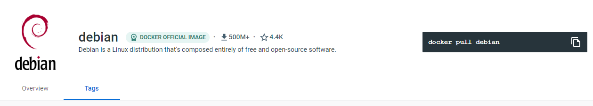
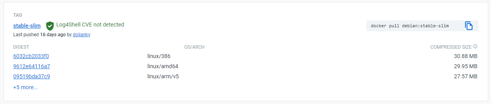

### Exercises dia 1: Utilizando Containers - Docker

Praticando os comandos no terminal!

<br>

_**Exercise - 1**_

 - No [Docker Hub](https://hub.docker.com/search?q=&type=image), utilizando a caixa de busca `("Search for great content")`, busque pela **`imagem`** da **_Distribuição Linux Debian_**;

 

_**Exercise - 2**_

 - Uma vez que encontrar a **_imagem oficial_**, acesse-a (clicando em seu card) e verifique na página de detalhes. Confira se existe algum comando para baixar a imagem localmente sem ter que criar um `container` para isso;



_**Exercise - 3**_

 - Baixe a **`imagem`** utilizando a _tag_: `stable-slim`, que é uma versão reduzida da distribuição;

 ```powershell
docker pull debian:stable-slim

# output:
stable-slim: Pulling from library/debian
7807d201190a: Pull complete 
Digest: sha256:6010a47db58fe1b2c986fe1e980f436886bf5f843d0f9c0cdaf5b342bfe9be69
Status: Downloaded newer image for debian:stable-slim
docker.io/library/debian:stable-slim
```

_**Exercise - 4**_

 - Após baixar a **`imagem`** para seu computador local, **crie** e **execute** um `container` no modo interativo utilizando essa **`imagem`** como referência — não esqueça referenciar a `tag`;

 ```powershell
docker container run -it debian:stable-slim

# output:
root@1072d0de2c81:/#
```

_**Exercise - 5**_

 - No terminal, você deve conseguir rodar o comando `cat /etc/*-release`, que vai retornar os dados da distribuição **Debian** que está sendo rodada dentro do `container`;

```powershell
cat /etc/*-release

# output:
PRETTY_NAME="Debian GNU/Linux 11 (bullseye)"
NAME="Debian GNU/Linux"
VERSION_ID="11"
VERSION="11 (bullseye)"
VERSION_CODENAME=bullseye
ID=debian
HOME_URL="https://www.debian.org/"
SUPPORT_URL="https://www.debian.org/support"
BUG_REPORT_URL="https://bugs.debian.org/"

```

_**Exercise - 6**_

 - Encerre o terminal;

 ```powershell
 root@4b662161955e:/# exit

 # output:
exit
```

_**Exercise - 7**_

 - Verifique na sua **lista de contêiners** qual `container` se refere ao exercício que acabou de praticar;

```powershell
docker ps -l

# output
 CONTAINER ID   IMAGE                COMMAND   CREATED         STATUS                          PORTS     NAMES
1072d0de2c81   debian:stable-slim   "bash"    5 minutes ago   Exited (0) About a minute ago             strange_booth
```

_**Exercise - 8**_

 - Inicie o mesmo `container` novamente, sem criar outro. Valide se ele está ativo na **lista de contêiners**;

 ```powershell
docker start strange_booth 

# output:
strange_booth

docker container ls

# output:
CONTAINER ID   IMAGE                COMMAND   CREATED         STATUS              PORTS     NAMES
1072d0de2c81   debian:stable-slim   "bash"    8 minutes ago   Up About a minute             strange_booth
```

_**Exercise - 9**_

 - Retome o `container` que foi criado anteriormente neste exercício;

 ```powershell
docker attach strange_booth

# output:
root@1072d0de2c81:/# 
```

_**Exercise - 10**_

 - Rode o comando `cat /etc/debian_version` que deve retornar a versão atual do sistema do `container`;

 ```powershell
cat /etc/debian_version

# output:
11.6
```

_**Exercise - 11**_

 - Encerre o terminal;

```powershell
root@1072d0de2c81:/# exit

# output:
exit
```

_**Exercise - 12**_

 - Remova somente o `container` criado para esse exercício;

 ```powershell
docker container rm strange_booth

# output:
strange_booth

docker container ls -a

#output:
CONTAINER ID   IMAGE     COMMAND   CREATED   STATUS    PORTS     NAMES
```

_**Exercise - 13**_

 - **[BÔNUS]** - Crie e rode de modo interativo em modo `‘Cleanup’`, a `imagem` `andrius/ascii-patrol`;

 ```powershell
docker run -it --rm andrius/ascii-patrol
# output:
```


 _**Exercise - 14**_

 - **[BÔNUS]** - Encerre o `container` utilizando os botões `ctrl + c`;

 ```
ctrl + c
```