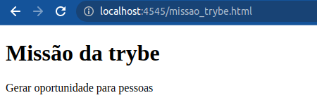
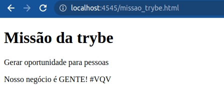
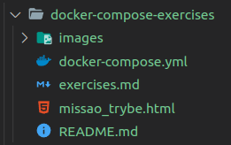
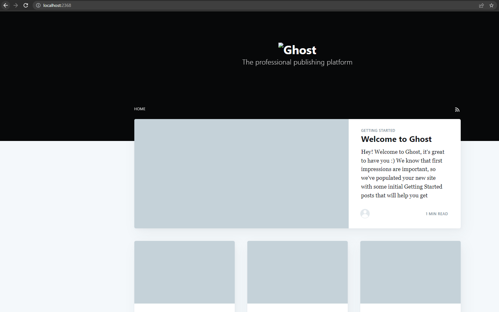
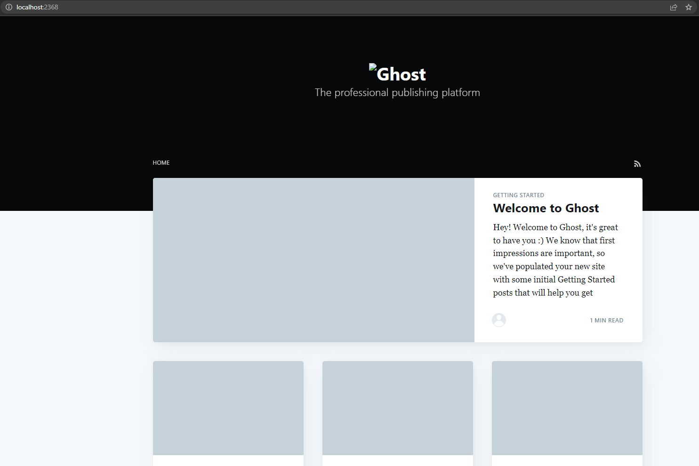

# Resolução dos exercícios propostos no README.md

- Comandos executados no terminal e seus _output's_

## Exercício 1:

> 1. Criação do arquivo missao_trybe.html

> 2. Crie um container para manter um servidor `httpd:2.4` **Apache** e vincule sua porta interna com a porta `4545` da sua máquina local;

```powershell

docker run -d --name missao-da-trybe -p 4545:80 -v /home/guivalgas/Trybe/trybe-exercicios/back-end/secao-01-Docker-utilizando-containers/dia-3-orquestrando-containers-com-docker-compose/docker-compose-exercises:/usr/local/apache2/htdocs httpd:2.4

# output:

Unable to find image 'httpd:2.4' locally
2.4: Pulling from library/httpd
3f9582a2cbe7: Pull complete 
9423d69c3be7: Pull complete 
d1f584c02b5d: Pull complete 
758a20a64707: Pull complete 
08507f82f391: Pull complete 
Digest: sha256:76618ddd53f315a1436a56dc84ad57032e1b2123f2f6489ce9c575c4b280c4f4
Status: Downloaded newer image for httpd:2.4
878b338f0ffbcfea983f917402dd96b9580dbaf2683b35d5c912c04f91b04e8e

# container listado:
docker ps -a                                                                                                                             
CONTAINER ID   IMAGE       COMMAND              CREATED          STATUS          PORTS                                   NAMES
878b338f0ffb   httpd:2.4   "httpd-foreground"   18 seconds ago   Up 10 seconds   0.0.0.0:4545->80/tcp, :::4545->80/tcp   missao-da-trybe

```

> 3. Após criar o container acesse a página `HTML` que está rodando no servidor em seu browser;

```
http://localhost:4545/missao_trybe.html
```



> 4. Acesse o arquivo `missao_trybe.html` e acrescente a tag `<p>` com o seguinte texto `“Nosso negócio é GENTE! #VQV”`;

```html
<!DOCTYPE html>
   <html>
      <head>
      <title>Trybe</title>
   </head>
   <body>
      <h1>Missão da Trybe</h1>
      <p>Gerar oportunidade para pessoas</p>
      <p>Nosso negócio é GENTE! #VQV</p>
   </body>
</html>
```



> 5. Obtenha o `id` do `container` `httpd:2.4`;

```powershell
docker ps
# output:
CONTAINER ID   IMAGE       COMMAND              CREATED          STATUS          PORTS                                   NAMES
878b338f0ffb   httpd:2.4   "httpd-foreground"   15 minutes ago   Up 15 minutes   0.0.0.0:4545->80/tcp, :::4545->80/tcp   missao-da-trybe

```

> 6. Obtenha o `Mounts` através da propriedade `Source` que deve mostrar o volume desse `container` no `Docker Host`;

```powershell
docker inspect 878b338f0ffb

# output:
[
    {
    <# "Id": "878b338f0ffbcfea983f917402dd96b9580dbaf2683b35d5c912c04f91b04e8e",
        "Created": "2023-03-21T13:45:18.520815505Z",
        "Path": "httpd-foreground",
        "Args": [],
        "State": {
           ...
        },
        ...
        "HostConfig": {
            ...
        },
        "GraphDriver": {
            ...
        }, #>
        "Mounts": [
            {
                "Type": "bind",
                "Source": "/home/guivalgas/Trybe/trybe-exercicios/back-end/secao-01-Docker-utilizando-containers/dia-3-orquestrando-containers-com-docker-compose/docker-compose-exercises",
                "Destination": "/usr/local/apache2/htdocs",
                "Mode": "",
                "RW": true,
                "Propagation": "rprivate"
            }
        ],
    <# "Config": {
            ...
        },
        "NetworkSettings": {
            ...
        } #>
    }
]
```

> 7. Agora **pare** o `container` `httpd:2.4`;

```powershell
docker stop missao-da-trybe 

#output:
missao-da-trybe

# Container parado:
CONTAINER ID   IMAGE       COMMAND              CREATED          STATUS                      PORTS     NAMES
878b338f0ffb   httpd:2.4   "httpd-foreground"   22 minutes ago   Exited (0) 48 seconds ago             missao-da-trybe
```

> 8. **Exclua** o seu `container`;

```powershell
docker rm 878b338f0ffb

# output:
878b338f0ffb
# check if container has been deleted:
docker ps -a
# output:
CONTAINER ID   IMAGE     COMMAND   CREATED   STATUS    PORTS     NAMES
```

> 9. Verifique se a **pasta** onde você salvou o arquivo `html` permanece no mesmo lugar;



> 10. Obtenha o `IMAGE ID` do **servidor**;

```powershell
docker images

# output:

REPOSITORY   TAG       IMAGE ID       CREATED       SIZE
httpd        2.4       daab1fa13f86   13 days ago   145MB
```

> 11. Depois de obter o `IMAGE ID`, **exclua** a `imagem`;

```powershell
docker rmi -f daab1fa13f86

# output:
Untagged: httpd:2.4
Untagged: httpd@sha256:76618ddd53f315a1436a56dc84ad57032e1b2123f2f6489ce9c575c4b280c4f4
Deleted: sha256:daab1fa13f8608841399e8552ab7833e90307543509ced13cd40b3f7411632a3
Deleted: sha256:15859036d211955e8f61de32e6859c476c2e063e54476e5aba9b9bc8070f9d59
Deleted: sha256:3bdcace1cb952fe0148d559f8f475d2f1a11a89be438bb751e54ab9319fa6d6a
Deleted: sha256:fca3788b555f943203b16a18dbcf000cb9d45e63aec5822fe765df6a1528ba39
Deleted: sha256:34d48bd6f8c2df806a7e17b671565d429802fd0ca17f1ae6b676393a952faa1b
Deleted: sha256:650abce4b096b06ac8bec2046d821d66d801af34f1f1d4c5e272ad030c7873db

# lista imagens:
docker images

# output:
REPOSITORY   TAG       IMAGE ID       CREATED       SIZE
```

## Exercício 2:

> 1. Crie o arquivo `Compose` seguindo os passos abaixo:
>    - Utilize a versão `“3”` no arquivo;
>    - Crie um `service` para subir a plataforma, utilize a `imagem` `ghost:1-alpine`;
>    - Publique a porta `2368`, fazendo `bind` também para a `2368`;

```yaml
# docker-compose.yaml
version: '3'
services:
  ghost:
    image: ghost:1-alpine
    ports:
      - 2368:2368
```

> 2. Suba a aplicação utilizando o `docker-compose` e então acesse a porta publicada para validar se deu tudo certo;

```powershell
docker compose up

# output:
Attaching to docker-compose-exercises-ghost-1
docker-compose-exercises-ghost-1  | [2023-03-21 14:48:36] INFO Creating table: posts  
docker-compose-exercises-ghost-1  | [2023-03-21 14:48:36] INFO Creating table: users  
docker-compose-exercises-ghost-1  | [2023-03-21 14:48:37] INFO Creating table: posts_authors  
docker-compose-exercises-ghost-1  | [2023-03-21 14:48:37] INFO Creating table: roles  
docker-compose-exercises-ghost-1  | [2023-03-21 14:48:37] INFO Creating table: roles_users  
docker-compose-exercises-ghost-1  | [2023-03-21 14:48:37] INFO Creating table: permissions  
docker-compose-exercises-ghost-1  | [2023-03-21 14:48:37] INFO Creating table: permissions_users  
docker-compose-exercises-ghost-1  | [2023-03-21 14:48:37] INFO Creating table: permissions_roles  
docker-compose-exercises-ghost-1  | [2023-03-21 14:48:37] INFO Creating table: permissions_apps  
docker-compose-exercises-ghost-1  | [2023-03-21 14:48:37] INFO Creating table: settings  
docker-compose-exercises-ghost-1  | [2023-03-21 14:48:37] INFO Creating table: tags 
docker-compose-exercises-ghost-1  | [2023-03-21 14:48:37] INFO Creating table: posts_tags  
docker-compose-exercises-ghost-1  | [2023-03-21 14:48:37] INFO Creating table: apps  
docker-compose-exercises-ghost-1  | [2023-03-21 14:48:37] INFO Creating table: app_settings  
docker-compose-exercises-ghost-1  | [2023-03-21 14:48:37] INFO Creating table: app_fields  
docker-compose-exercises-ghost-1  | [2023-03-21 14:48:37] INFO Creating table: clients  
docker-compose-exercises-ghost-1  | [2023-03-21 14:48:37] INFO Creating table: client_trusted_domains  
docker-compose-exercises-ghost-1  | [2023-03-21 14:48:37] INFO Creating table: accesstokens  
docker-compose-exercises-ghost-1  | [2023-03-21 14:48:37] INFO Creating table: refreshtokens  
docker-compose-exercises-ghost-1  | [2023-03-21 14:48:37] INFO Creating table: subscribers  
docker-compose-exercises-ghost-1  | [2023-03-21 14:48:37] INFO Creating table: invites  
docker-compose-exercises-ghost-1  | [2023-03-21 14:48:37] INFO Creating table: brute  
docker-compose-exercises-ghost-1  | [2023-03-21 14:48:37] INFO Creating table: webhooks  
docker-compose-exercises-ghost-1  | [2023-03-21 14:48:37] INFO Model: Tag  
docker-compose-exercises-ghost-1  | [2023-03-21 14:48:37] INFO Model: Client  
docker-compose-exercises-ghost-1  | [2023-03-21 14:48:37] INFO Model: Role  
docker-compose-exercises-ghost-1  | [2023-03-21 14:48:37] INFO Model: Permission  
docker-compose-exercises-ghost-1  | [2023-03-21 14:48:37] INFO Model: User  
docker-compose-exercises-ghost-1  | [2023-03-21 14:48:37] INFO Model: Post  
docker-compose-exercises-ghost-1  | [2023-03-21 14:48:37] INFO Relation: Role to Permission  
docker-compose-exercises-ghost-1  | [2023-03-21 14:48:37] INFO Relation: Post to Tag  
docker-compose-exercises-ghost-1  | [2023-03-21 14:48:37] INFO Relation: User to Role  
docker-compose-exercises-ghost-1  | [2023-03-21 14:48:37] INFO Finished database migration!   
docker-compose-exercises-ghost-1  | [2023-03-21 14:48:37] WARN Theme's file locales/en.json not found.  
docker-compose-exercises-ghost-1  | [2023-03-21 14:48:37] INFO Ghost is running in production...  
docker-compose-exercises-ghost-1  | [2023-03-21 14:48:37] INFO Your blog is now available on http://localhost:2368/  
docker-compose-exercises-ghost-1  | [2023-03-21 14:48:37] INFO Ctrl+C to shut down  
docker-compose-exercises-ghost-1  | [2023-03-21 14:48:37] INFO Ghost boot 2.335s  
```

```
http://localhost:2368/

```




## Exercício 3:

> 1. Crie um novo serviço para o nosso banco de dados, podemos utilizar um `mysql`, utilize a `imagem` `mysql:5.7`;

```yaml
# docker-compose.yaml
version: '3'
services:
  ghost:
    image: ghost:1-alpine
    ports:
      - 2368:2368
  db:
    image: mysql:5.7
```

> 2. Precisamos definir uma senha `root` para o nosso _bd_, para isso utilize a variável `MYSQL_ROOT_PASSWORD`, lembre-se que é possível utilizar a sintaxe `${}` para passar uma _env_ do `host`, para a _env_ do `container`;

```yaml
# docker-compose.yaml
version: '3'
services:
  ghost:
    image: ghost:1-alpine
    ports:
      - 2368:2368
  db:
    image: mysql:5.7.40
    environment:
      MYSQL_ROOT_PASSWORD: password
```

> 3. Agora precisamos configurar nosso `service` com o `ghost` para utilizar o `MySQL`, para isso defina a variável `database__client` para `mysql`;

```yaml
# docker-compose.yaml
version: '3'
services:
  ghost:
    image: ghost:1-alpine
    restart: always
    ports:
      - 2368:2368
    depends_on:
      - "db"
    environment:
      # see https://ghost.org/docs/config/
      database__client: mysql
  db:
    image: mysql:5.7.40
    environment:
      MYSQL_ROOT_PASSWORD: password
```  

> 4. Defina o nome `ghost` para o nome do _database_ utilizando a variável `database__connection__database`;
```yaml
# docker-compose.yaml
version: '3'
services:
  ghost:
    image: ghost:1-alpine
    restart: always
    ports:
      - 2368:2368
    depends_on:
      - "db"
    environment:
      # see https://ghost.org/docs/config/
      database__client: mysql
      database__connection__database: ghost
  db:
    image: mysql:5.7.40
    environment:
      MYSQL_ROOT_PASSWORD: password
```

> 5. E então, indique a conexão para o nosso `MySQL` na _env_ `database__connection__host`;

```yaml
# docker-compose.yaml
version: '3'
services:
  ghost:
    image: ghost:1-alpine
    restart: always
    ports:
      - 2368:2368
    depends_on:
      - "db"
    environment:
      # see https://ghost.org/docs/config/
      database__client: mysql
      database__connection__database: ghost
      database__connection__host: db
  db:
    image: mysql:5.7.40
    environment:
      MYSQL_ROOT_PASSWORD: password
```

> 6. Para definir a pessoa usuária (_`root`_) e senha (_a mesma que definimos no nosso `MySQL`_), utilize respectivamente as _envs_ `database__connection__user` e `database__connection__password`;  

```yaml
# docker-compose.yaml
version: '3'
services:
  ghost:
    image: ghost:1-alpine
    restart: always
    ports:
      - 2368:2368
    depends_on:
      - "db"
    environment:
      # see https://ghost.org/docs/config/
      database__client: mysql
      database__connection__database: ghost
      database__connection__host: db
      database__connection__user: root
      database__connection__password: password
  db:
    image: mysql:5.7.40
    environment:
      MYSQL_ROOT_PASSWORD: password
```

> 7. Utilize a opção `depends_on` para criar **relações de dependências** entre os serviços;

```yaml
# docker-compose.yaml
version: '3'
services:
  ghost:
    image: ghost:1-alpine
    restart: always # To ensure db connection
    ports:
      - 2368:2368
    depends_on:
      - "db"
    environment:
      # see https://ghost.org/docs/config/
      database__client: mysql
      database__connection__database: ghost
      database__connection__host: db
      database__connection__user: root
      database__connection__password: password
  db:
    image: mysql:5.7.40
    environment:
      MYSQL_ROOT_PASSWORD: password
```

> 8. Suba o ambiente com o novo arquivo usando o `docker-compose` e então **acesse a porta**;

```powershell
# run 'docker start CONTAINER_ID' if container is not running
docker compose up

# output:
# [...]
docker-compose-exercises-ghost-1  | [2023-03-21 15:12:22] INFO Ghost is running in production...
docker-compose-exercises-ghost-1  | [2023-03-21 15:12:22] INFO Your blog is now available on http://localhost:2368/
docker-compose-exercises-ghost-1  | [2023-03-21 15:12:22] INFO Ctrl+C to shut down
docker-compose-exercises-ghost-1  | [2023-03-21 15:12:22] INFO Ghost boot 2.179s
```

## Exercício 4:

> 1. Configure o nosso serviço `mysql` para utilizar um **volume**, conforme vimos no conteúdo, utilize o caminho _target_ `/var/lib/mysql`;

```yaml
# docker-compose.yaml
version: '3'
services:
  ghost:
    image: ghost:1-alpine
    restart: always # To ensure db connection
    ports:
      - 2368:2368
    depends_on:
      - "db"
    environment:
      # see https://ghost.org/docs/config/
      database__client: mysql
      database__connection__database: ghost
      database__connection__host: db
      database__connection__user: root
      database__connection__password: password
  db:
    # Caso utilize MacOS, descomente essa linha abaixo:
    # platform: linux/x86_64
    image: mysql:5.7
    environment:
      MYSQL_ROOT_PASSWORD: password
    volumes:
          - db-data:/var/lib/mysql
  volumes:
      db-data:
```

> 2. Ao invés de utilizar a rede padrão criada pelo **Compose**, defina uma rede chamada `my-network` para a comunicação dos dois serviços;

```yaml
# docker-compose.yaml
version: '3'
services:
  ghost:
    image: ghost:1-alpine
    restart: always # To ensure db connection
    ports:
      - 2368:2368
    depends_on:
      - "db"
    environment:
      # see https://ghost.org/docs/config/
      database__client: mysql
      database__connection__database: ghost
      database__connection__host: db
      database__connection__user: root
      database__connection__password: password
    networks:
          - my-network
  db:
    # Caso utilize MacOS, descomente essa linha abaixo:
    # platform: linux/x86_64
    image: mysql:5.7
    restart: always # To ensure db connection
    environment:
      MYSQL_ROOT_PASSWORD: password
    volumes:
          - db-data:/var/lib/mysql
    networks:
          - my-network
  volumes:
      db-data:
  networks:
      my-network:
```

> 3. Suba o ambiente com o novo arquivo usando o `docker-compose` e então acesse-o;

```powershell
docker compose up -d
# output:
[+] Running 4/4
 ⠿ Network docker-compose-exercises_my-network  Created                                                                                          0.1s
 ⠿ Volume "docker-compose-exercises_db-data"    Created                                                                                          0.0s
 ⠿ Container docker-compose-exercises-db-1      Started                                                                                          0.5s
 ⠿ Container docker-compose-exercises-ghost-1   Started 
```

```
http://localhost:2368/
```

