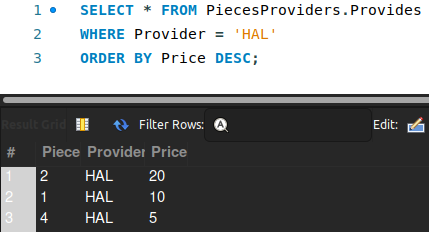

# Resolução dos exercícios propostos no README.md

## Exercício 1
> Escreva uma query para exibir a peça e o preço de tudo que é provido pela empresa RBT.

```SQL
SELECT Piece, Price FROM PiecesProviders.Provides
WHERE Provider = 'RBT';
```


## Exercício 2
> Escreva uma query para exibir a peça e o preço de tudo que é provido pela empresa RBT.

```SQL
SELECT Piece, Price FROM PiecesProviders.Provides
ORDER BY Price DESC
LIMIT 5;
```


## Exercício 3
> Escreva uma query para exibir a peça e o preço de tudo que é provido pela empresa RBT.

```SQL
SELECT DISTINCT Provider, Price FROM PiecesProviders.Provides
ORDER BY Price DESC
LIMIT 4 OFFSET 2;
```


## Exercício 4
> Escreva uma query para exibir a peça e o preço de tudo que é provido pela empresa RBT.

```SQL
SELECT * FROM PiecesProviders.Provides
WHERE Provider = 'HAL' 
ORDER BY Price DESC;
```



## Exercício 5
> Escreva uma query para exibir a peça e o preço de tudo que é provido pela empresa RBT.

```SQL
SELECT COUNT(Provider) FROM PiecesProviders.Provides
WHERE Piece = 1;
```


