# Resolução dos exercícios propostos no README

## Exercício 1
> Escreva uma query para exibir a string “This is SQL Exercise, Practice and Solution”.

```SQL
SELECT 'This is SQL Exercise, Practice and Solution';
```
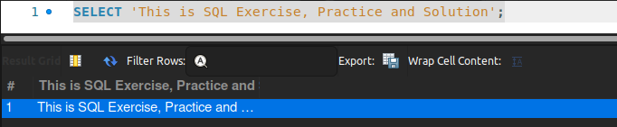

## Exercício 2
> Escreva uma query para exibir três números em três colunas.

```SQL
SELECT 1, 2, 3;
```
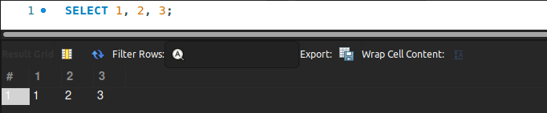

## Exercício 3
>Escreva uma query para exibir a soma dos números 10 e 15.

```SQL
SELECT 10 + 15;
```

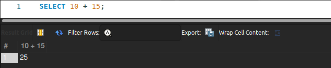

## Exercício 4
> Escreva uma query para exibir o resultado de uma expressão aritmética qualquer.

```SQL
SELECT (10 * 2) + 12;
```

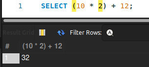

## Exercício 5
> Escreva uma query para exibir todas as informações de todos os cientistas.

```SQL
SELECT * FROM Scientists;
```


## Exercício 6
> Escreva uma query para exibir o nome como “Nome do Projeto” e as horas como “Tempo de Trabalho” de cada projeto.

```SQL
SELECT Name AS 'Nome do Projeto', Hours AS 'Tempo de Trabalho' FROM Projects;
```

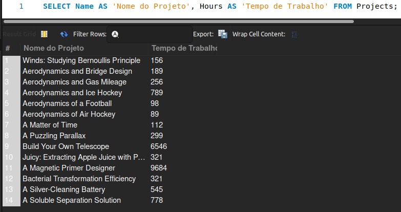

## Exercício 7
> Escreva uma query para exibir o nome dos cientistas em ordem alfabética.

```SQL
SELECT Name FROM Scientists
ORDER BY Name ASC;
```

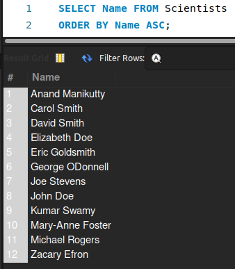

## Exercício 8
>  Escreva uma query para exibir o nome dos projetos em ordem alfabética descendente.

```SQL
SELECT Name FROM Projects
ORDER BY Name DESC;
```

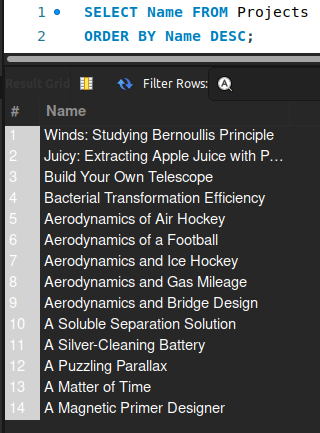

## Exercício 9
> Escreva uma query que exiba a string “O projeto Name precisou de Hours horas para ser concluído.” para cada projeto.

```SQL
SELECT CONCAT('O projeto ', Name, ' precisou de ', Hours, ' horas para ser concluído.') as resultado FROM Projects;
```

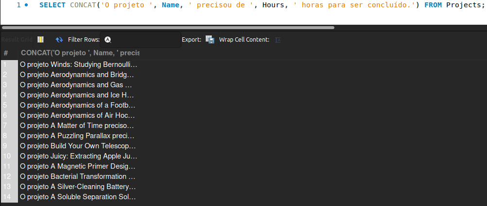

## Exercício 10
> Escreva uma query para exibir o nome e as horas dos três projetos com a maior quantidade de horas.

```SQL
SELECT Name, Hours FROM Projects
ORDER BY Hours DESC LIMIT 3;
```

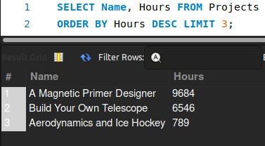

## Exercício 11
> Escreva uma query para exibir o código de todos os projetos da tabela AssignedTo sem que haja repetições.

```SQL
SELECT DISTINCT Project FROM AssignedTo;
```

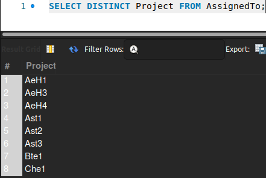

## Exercício 12
> Escreva uma query para exibir o nome do projeto com maior quantidade de horas.

```SQL
SELECT Name FROM Projects
ORDER BY Hours DESC
LIMIT 1;
```

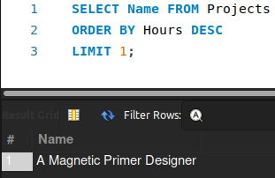

## Exercício 13
> Escreva uma query para exibir o nome do segundo projeto com menor quantidade de horas.

```SQL
SELECT Name FROM Projects
ORDER BY Hours ASC
LIMIT 1
OFFSET 1
```

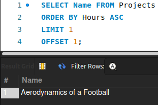

## Exercício 14
> Escreva uma query para exibir todas as informações dos cinco projetos com a menor quantidade de horas.

```SQL
SELECT * FROM Projects
ORDER BY Hours ASC
LIMIT 5;
```

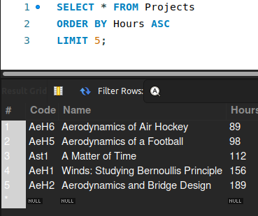


## Exercício 15
> Escreva uma query que exiba a string “Existem Number cientistas na tabela Scientists.”, em que Number se refira a quantidade de cientistas.

```SQL
SELECT CONCAT('Existem ', COUNT(Name), ' cientistas na tabela Scientists.') as resultado FROM Scientists;
```

- Para não retornar BLOB é necessário clicar com botão direito em cima do `BLOB` ir em 'Open value in viewer' e selecionar a aba `text`

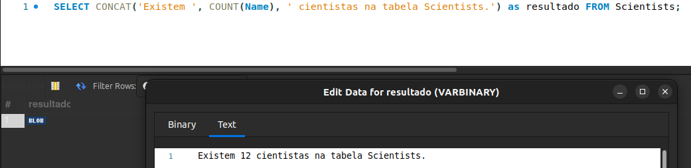


