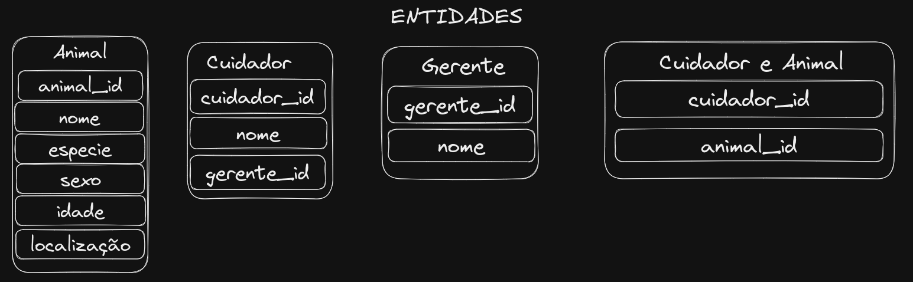
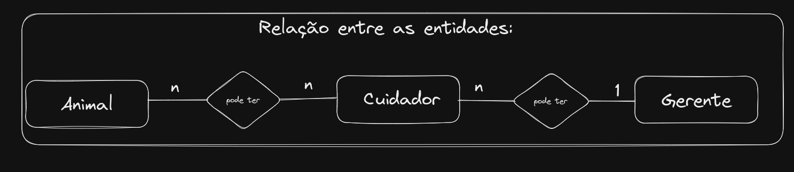

# Resolução dos exercícios propostos no README

## Exercício 1
> Um zoológico precisa de um banco de dados para armazenar informações sobre os seus animais. As informações a serem armazenadas sobre cada animal são:

 - Nome;

 - Espécie;

 - Sexo;

 - Idade;

 - Localização.

Cada animal também possui vários cuidadores, e cada cuidador pode ser responsável por mais de um animal. Além disso, cada cuidador possui um gerente, sendo que cada gerente pode ser responsável por mais de um cuidador.

## Resposta:

<br>

- Identificando entidades:  

  

<br>

- Identificando **Atributos**:

  - Animal: `animal_id`, `nome`, `especie`, `sexo`, `idade` e `localização`;
  - Cuidador: `cuidador_id`, `nome`, `gerente_id`;
  - Gerente: `gerente_id` e `nome`;
  - Cuidador e Animal: `cuidador_id` e `animal_id`;

<br>

- Identificando os **relacionamentos**:
  - Um animal pode ter um ou mais cuidadores;
  - Um cuidador pode cuidar de um ou mais animais;
  - Um gerente pode gerenciar uma ou mais cuidadores;
  - Um cuidador possui um gerente;

   


- Diagrama de relacionamentos detalhados das tabelas `gerente`, `cuidador`, `animal` e `animal_cuidador`
<br>  
    

<br> 


> Criação do banco de dados
```SQL
DROP SCHEMA IF EXISTS zoologico;
CREATE SCHEMA zoologico;
USE zoologico;
```

> Criação da tabela de animais:
```SQL
CREATE TABLE animal(
    animal_id INT PRIMARY KEY AUTO_INCREMENT,
    nome VARCHAR(50) NOT NULL,
    especie VARCHAR(50) NOT NULL,
    sexo VARCHAR(50) NOT NULL,
    idade INT NOT NULL,
    localizacao VARCHAR(50) NOT NULL
);
```

> Criação da tabela de gerentes:
```SQL
CREATE TABLE gerente(
    gerente_id INT PRIMARY KEY AUTO_INCREMENT,
    nome VARCHAR(50) NOT NULL
);
```

> Criação da tabela de cuidador:
  - Relacionando cada cuidador a seu gerente usando uma chave estrangeira (`foreign key`)
  <br>  
```SQL
  CREATE TABLE cuidador(
    cuidador_id INT PRIMARY KEY AUTO_INCREMENT,
    nome VARCHAR(50) NOT NULL,
    gerente_id INT NOT NULL,
    FOREIGN KEY (gerente_id) REFERENCES gerente (gerente_id)
);
```

> Criação da tabela de relacionamento entre os animais e seus cuidadores:
```SQL
CREATE TABLE animal_cuidador(
    animal_id INT,
    cuidador_id INT,
    CONSTRAINT PRIMARY KEY(animal_id, cuidador_id),
    FOREIGN KEY (animal_id) REFERENCES animal (animal_id),
    FOREIGN KEY (cuidador_id) REFERENCES cuidador (cuidador_id)
);
```