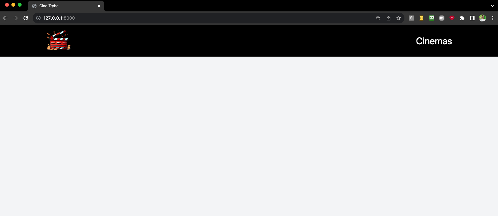

# Exercícios: Testando aplicações Django -

## Execução da aplicação Cine Django
---

1. Faça o build da imagem do docker

```bash
docker build -t cinetrybe-db .
```

2. Execute o container

```bash
docker run -d -p 3306:3306 --name=cinetrybe-mysql-container -e MYSQL_ROOT_PASSWORD=password -e MYSQL_DATABASE=cinetrybe_database cinetrybe-db
```

3. Crie o ambiente virtual e o ative

```bash
python3 -m venv .venv && source .venv/bin/activate
```

4. Instale as dependências do projeto

```bash
python3 -m pip install -r requirements.txt
```

5. Execute o comando para criar as migrações e aplicá-las:

```bash
python3 manage.py makemigrations && python3 manage.py migrate
```

6. Execute o servidor para ver a aplicação em funcionamento:

```bash
python3 manage.py runserver
```



## Exercício 1 - Testando a tabela `movieroom`
- Implemente os testes para a tabela `movieroom` do banco de dados no arquivo `tests/test_db.py`. Essa é a tabela relacionada ao modelo `MovieRoom` da aplicação.

## Exercício 2 - Testando o template `room_details.html`
- Implemente os testes para o template `room_details.html` no arquivo `tests/test_room_details.py`. A função da view que usa o template é a `room_details`.

## Exercício 3 - Testando o C.R.U.D. do modelo `Genre`
- Implemente os testes para todas as operações do C.R.U.D. do modelo `Genre` no arquivo `tests/test_genre_endpoint.py`.

## Exercício 4 - Testando o C.R.U.D. do modelo `Movie`
- Implemente os testes para todas as operações do C.R.U.D. do modelo `Movie` no arquivo `tests/test_movie_endpoint.py`.

## [Bônus] Exercício 5 - Testando a tabela `movieseat`
- Implemente os testes para a tabela movieseat do banco de dados no arquivo `tests/test_db.py`. Essa é a tabela relacionada ao modelo `MovieSeat` da aplicação.

## [Bônus] Exercício 6 - Testando o C.R.U.D. do modelo `MovieRoom`
- Implemente os testes para todas as operações do C.R.U.D. do modelo `MovieRoom`no arquivo `tests/test_movie_room_endpoint.py`.

## [Bônus] Exercício 7 - Testando o C.R.U.D. do modelo `MovieSeat`
- Implemente os testes para todas as operações do C.R.U.D. do modelo `MovieSeat` no arquivo `tests/test_movie_seat_endpoint.py`.